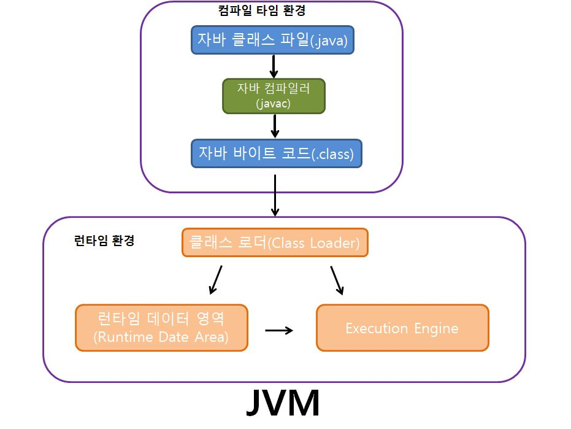
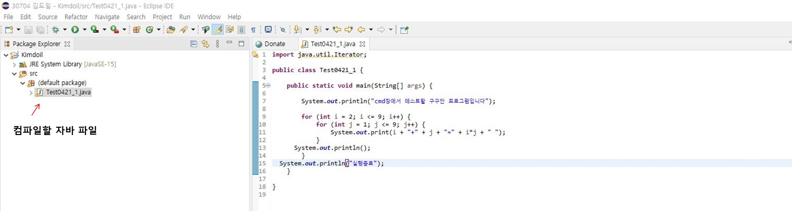
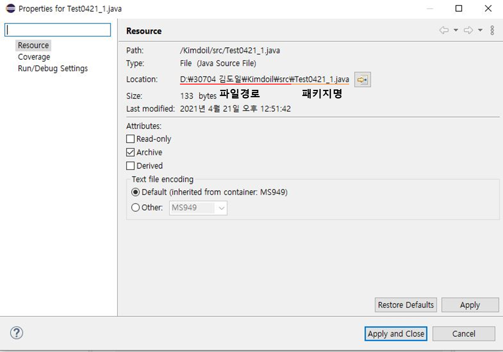
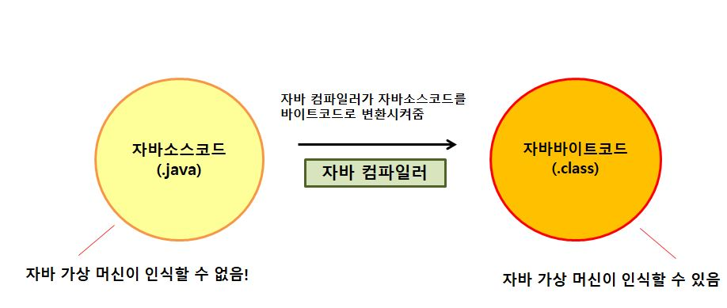
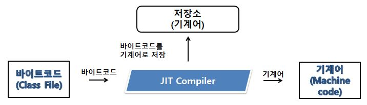
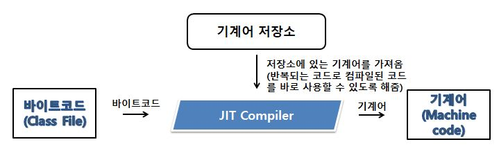

## 4월 21일 1주차

- JVM이란 무엇인가?
- 컴파일 하는 방법
- 실행하는 방법
- 바이트코드란 무엇인가?
- JIT 컴파일러란 무엇이며 어떻게 동작하는지
- JVM 구성 요소
- JDK와 JRE의 차이
  <br>
  <br>
  <br>

# JVM 이란 무엇인가?

### 용도

**자바가상머신(Java Virtual Machine)** 은 자바 프로그램이 어는 기기, 또는 어느 운영체제 상에서도 실행될 수 있게 하는 것과 프로그램 메모리를 관리하고 최적화하는 것이다. <br>

> 한 번 작성해, 어디에서나 실행한다

<br>

### 동작원리

1. 자바컴파일러가 .java 파일을 .class 라는 java byte code로 컴파일시켜줍니다.
2. 컴파일된 바이트코드를 JVM의 클래스로더에게 전달합니다.
3. 클래스 로더는 동적로딩을 통해 필요한 클래스들을 로딩 및 링크하여 런타임 데이터 영역, 즉 JVM 메모리에 올린다.
4. 실행엔진은 JVM메모리에 올라온 바이트 코드들을 명령어 단위로 하나씩 가져와서 실행한다.

 

<br>
<br>

### 장점

- JVM을 구성할 수 있다면 어느 플램폼에서든지 이식할 수 있다
- 사용하지 않는 메모리를 자동으로 회수합니다. 이로 인해 개발자가 따로 메모리를 관리하지 않아도 된다.

<br>
<br>
<br>

# 자바코드를 컴파일 하는 방법

### cmd창에서 자바코드 컴파일하기

<br>
<br>



### 1. 자바소스가 저장된 주소를 확인한다. (properties를 통해 확인)

<br>
<br>


### 2. cd 경로를 입력해 해당 폴더까지 접근해줍니다.

<br>
<br>


### 3. 컴파일할 자바파일 앞에 javac를 입력하면 끝!

<br>
<br>


### 실제 경로에서 컴파일된 자바파일을 확인 할 수 있습니다(.class파일).

<br>
<br>
<br>

# 자바코드를 실행하는 방법

### cmd창에서 자바코드 실행하기

<br>
<br>
<br>


### 1. 실행할 자바파일 앞에 javac 대신 java를 입력

<br>
<br>


### 2. cmd창을 통해 실행여부 확인!

<br>
<br>
<br>

# 바이트코드란 무엇인가?

우리가 직접 작성한 자바소스코드(.java)는 가상머신이 해당코드를 그대로 사용하면 문제가 생깁니다. 즉 **'가상머신이 인식하기 쉬운 코드'** 로 <br> 변환이 필요합니다. 그 코드가 자바 바이트 코드입니다.

**#자바 바이트 코드(Java bytecode)** 란 자바 가상 머신이 이해할 수 있는 언어로 변환된 자바 소스 코드를 의미합니다.

<br>



<br>
<br>
<br>

# JIT 컴파일러란 무엇이며 어떻게 동작하는가?

일반적으로 컴파일러는 개발자와 최종 사용자를 위한 애플리케이션의 속도를 결정하는 데 있어 핵심이다. <br>
**JIT(Just-in-Time) 컴파일러** 는 바이트코드를 컴퓨터 프로세서(CPU)로 직접 보낼 수 있는 명령어로 바꾸는 프로그램이다.

JIT 컴파일러는 한번 읽어서 기계어로 변경한 소스코드는 번역하지 않는다. 그렇기에 속도 향상에 도움이 된다. ▼



<br>
<br>
<br>

# JVM 구성 요소

### 자바메모리 구조 (Runtime Data Area)

JVM 이 **프로그램을 수행하기 위해 할당 받는 메모리 영역.** <br> 각각의 목적에 따라 아래 5개의 영역으로 나뉜다. <br>
`PC Registers, Method Area, Heap, JVM Stacks, Native Method Stacks`
<br>
<br>

### 가비지 컬렉션 (Garbage Collector)

메모리 관리 기법 중 하나로 프로그램이 동적으로 할당했던 메모리 영역 중에서 필요없게 된 영역을 해제하는 기능이다.
<br> GC를 이용하게 되면 프로그래머가 동적으로 할당한 메모리 영역 전체를 완벽하게 관리하지 않아도 된다. 즉, **GC를 통해 버그를 줄이거나 막을 수 있다.**

<br>
<br>

### 클레스 로더 (Class Class Loader)

자바 클래스로더(Java Classloader)는 자바 클래스를 자바 가상 머신(JVM)으로 동적 로드하는 자바 런타임 환경(JRE)의 일부이다. <br>
클래스 로더라는 이름 그대로 클래스파일을 적재하는 역할을 합니다. 클래스 로더는 아래 순서로 진행됩니다.

```
로딩 : 클래스 로더가 클래스파일을 읽고 그 내용에 따라 적절한 바이너리 데이터를 만들고, 로딩이 끝나면 해당 클래스 타입의 클래스객체를 생성하여 저장.

링크 : Verify, Prepare, Resolve 세 단계로 나누어져 있다.
Verify - .class 파일 형식이 유효한지 체크
Prepare - 클래스 변수와 기본값에 필요한 메모리
Resolve - 심볼릭 메모리 래퍼런스를 메서드 영역에 있는 실제 레퍼런스로 교체.

초기화 : static 변수의 값을 할당.
```

<br>
<br>

### 실행 엔진 (Execution Engine)

Execution Engine은 Class Loader에 의해 메모리에 적재된 **클래스(바이트코드)들을 기계어로 변경** 해 명령어 단위(operation Code)로 실행하는 것을 말한다.
<br>
<br>
<br>

# JDK와 JRE의 차이

### JRE

- 자바 프로그램을 동작시킬 때 필요한 라이브러리 파일들을 가지고 있다.
- JRE는 자바프로그램을 실행시키기 위해 필요하다.
- 하지만 **자바 프로그래밍 도구는** 포함하지 않기에 자바프로그래밍을 하기 위해선 JDK가 필요하다.
  <br>
  <br>

### JDK

- 자바 개발을 위한 도구들을 포함한다.
- JDK를 설치하면 JRE도 같이 설치된다. **즉 JDK = JRE + 자바프로그래밍 도구** 로 생각하면 된다.

<br>


