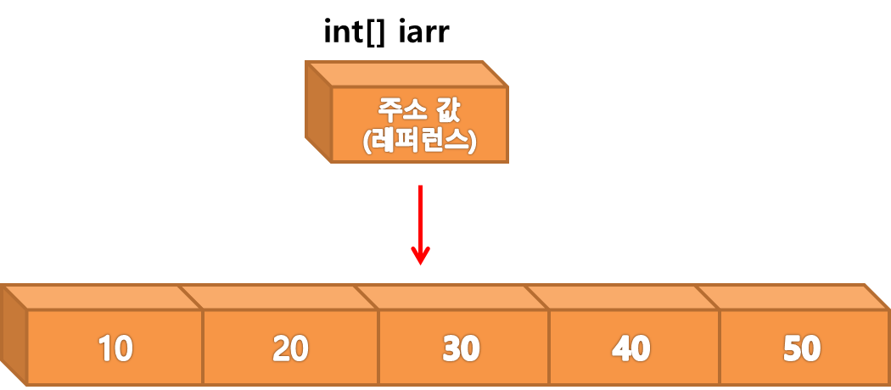
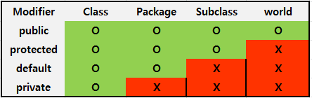
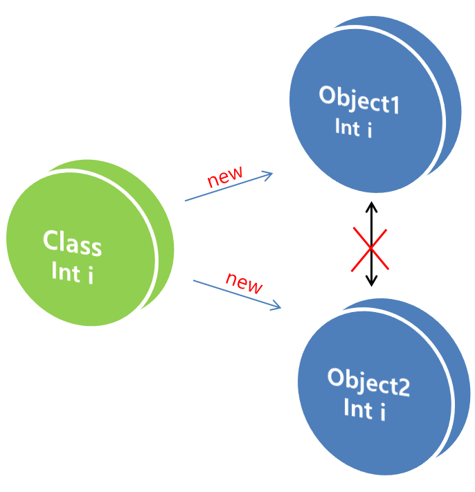

# 5. 배열

### 배열을 선언하는 두 가지 방법

```java
int[] iarr = new int[5];
iarr[0] = 10;
iarr[1] = 20;
iarr[2] = 30;
iarr[3] = 40;
iarr[4] = 50;

int[] iarr = {10, 20, 30, 40, 50};
```

<br>

### 레퍼런스의 이해

1. **기초자료형 변수**
   메모리에 i라는 변수가 만들어 지고, i안에 10이라는 데이터가 들어 간다.
   <br>
   
   <br>

 <br>

2. **배열**
   메모리에 iarr이라는 배열이 만들어지고, iarr배열안에는 배열을 구성하고 있는 데이터 주소값이 들어 있다.
   <br>
   

<br>

#### 실습해보기

<br>

```java
public class ArrTest1_1 {

	public static void main(String[] args) {
		int[] arr = {3, 6, 9};
		int a = arr[0];

		for (int i = 0; i < arr.length; i++) {
			System.out.println(arr[i]);
		}

		a = 30;

		for (int i = 0; i < arr.length; i++) {
			System.out.println(arr[i]);
		}


	}

출력 값:
3
6
9

3
6
9
```

<br>

**기초자료형 변수 a에 arr[0] 값을 넣은 후, 값을 변경해도 배열 arr값에는 지장이 없다**

<br>

```java
public class ArrTest1_1 {

	public static void main(String[] args) {
		int[] arr = {3, 6, 9};
		int[] a = arr;

		for (int i = 0; i < arr.length; i++) {
			System.out.println(arr[i]);
		}

		a[0] = 30;

		for (int i = 0; i < arr.length; i++) {
			System.out.println(arr[i]);
		}


	}

출력 값:
3
6
9

30
6
9
```

<br>

**배열 a에 arr 값을 넣은 후, arr[0] 값을 변경하자 배열 arr값이 변경된다**

<br>

# 6. 객체지향 프로그래밍

### 메소드

<br>

1. **메소드 이용하기**

```
[접근제한자*] [반환형] [메소드명] (파라미터 값){


}
```

<br>

2. **접근제한자의 종류**

  

<br>

#### 실습해보기

**사용자로부터 1~9까지 숫자 중 한개의 숫자를 입력받아 구구단 출력하기**

<br>

```java
public class MethodTest {


	public static void main(String[] args) {

		Scanner sc = new Scanner(System.in);

		System.out.print("입력:");
		int input = sc.nextInt();

		MethodTest GUGUDan = new MethodTest();
		GUGUDan.guguDan(input);

	}

	public void guguDan(int i) {
		for (int j = 1; j < 10; j++) {
			System.out.println(i + "*" + j + "=" + i*j);
		}

	}

}

출력값:

입력 4
4*1=4
4*2=8
4*3=12
4*4=16
4*5=20
4*6=24
4*7=28
4*8=32
4*9=36
```

<br>

# 7. 객체지향 프로그램의 본질

#### 객체 자료형과 데이터와의 관계

 

**두 객체는 같은 클래스로 부터 생성되었지만, 완전한 독립체이다.**
**객체 안에 종속되어 있는 데이터는 완전히 별개의 데이터이다.**

<br>

#### 실습해보기

```java
public class Color {
	public static String carColor(String color) {

		System.out.println("자동차의 색상은" + color + "입니다.");

		return color;

}
}

```

<br>

```java
public class MethodTest {

	public static void main(String[] args) {

		Scanner sc = new Scanner(System.in);

		System.out.print("색상입력 ");
		String input = sc.nextLine();

		Color.carColor(input);


	}


}

결과값:
색상입력 빨강
자동차의 색상은 빨강입니다.

```

<br>

```java
public class ObjectTest {

	public static void main(String[] args) {

        Scanner sc = new Scanner(System.in);

		System.out.print("색상입력 ");
		String input = sc.nextLine();

		Color.carColor(input);
	}

}

결과값:
색상입력 초록
자동차의 색상은 초록입니다.

```

<br>

## Call by value란?

**Call by value는 가장 일반적인 함수 호출형태로 값을 복사하는 것이다.**
<br>

**두개의 숫자 바꾸기 예제**

```java
public class Coll_by_value {

	public static void main(String[] args) {
        int num1 = 10;
        int num2 = 20;
		swap(num1, num2);
		System.out.println("num1 = " + num1);
		System.out.println("num2 = " + num2);
	}

    	static void swap(int num1, int num2)
	{
	    int temp = num1;
	    num1 = num2;
	    num2 = temp;
	}

}

결과값:
num1 = 10
num2 = 20
```

**자바에서 기본적으로 사용되는 값 호출 방식입니다.**

## Call by reference란?

**Call by reference는 값이 아닌 주소를 넘겨줌으로써, 주소를 참조하여 데이터를 변경할 수 있다.**

<br>

**두개의 숫자 바꾸기 예제**

```java
public class Coll_by_reference {

	public static void main(String[] args) {
		int[] arr = {3, 6};

		test(arr);
		System.out.println("arr[0] = " + arr[0]);
		System.out.println("arr[1] = " + arr[1]);

	}
	public static void test(int[] arr)
	{
		int temp = arr[0];
		arr[0] = arr[1];
		arr[1] = temp;

	}

}

결과값:
arr[0] = 6
arr[1] = 3

```

**객체인 배열은 주소값을 통해 값을 가져오기 때문에 예제가 잘 실행됩니다..**
<br>

```java
public class Coll_by_reference {


	public static void main(String[] args) {
		NumberClass num1 = new NumberClass(10);
		NumberClass num2 = new NumberClass(20);

		swap(num1, num2);
		System.out.println("num1 = " + num1.num);
		System.out.println("num2 = " + num2.num);
	}

	static void swap(NumberClass num1, NumberClass num2) {
		int temp;

		temp = num1.num;
		num1.num = num2.num;
		num2.num = temp;
	}

}

class NumberClass {
	int num;

	NumberClass (int num) {
		this.num = num;
	}
}

결과값:
num1 = 20
num2 = 10

```

**NumberClass라는 메소드를 이용하여 주소값을 참조할 수 있게끔 만들어 예제가 잘 실행됩니다.**

<br>

## integer란?

**자료형에 대한 정보를 갖고 있는 클래스 Wrapper class이다.**

## Array list란?
