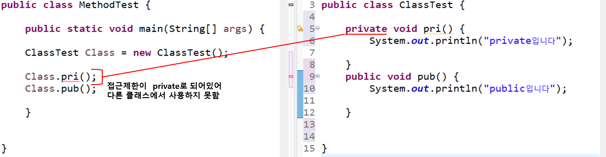

## 클래스 이용하기

1. **클레스 제작하기**

```java
package tset;
public Class MainClass{
        public MainClass(){

        }

}
```

2. **클레스 호출하기**

```java
MainClass mc = new MainClass();
```

<br>

### this를 사용하는 이유

 <br>
**위 처럼 클래스 내에 전역변수, 지역변수에 이름이 같을 경우 구분하기 위하여 this를 사용한다.**

## 클래스 실전

### Array list 사용법

```java
ArrayList<Integer> list = new ArrayList<>();
	//ArrayList 선언

	list.add(10);
	list.add(null);
	//list에 값 추가

	list.size();
	//list 크기 구하기

	list.remove(0);
	//list 0번째 인덱스 값 제거

	list.contains(1);
	//list 0번째 인덱스 값 조회
```

### 자바로 쇼핑몰 회원 관리 프로그램 만들기

1. **쇼핑몰에 회원정보(이름, 나이, 등급)을 입력.**
2. **가입한 회원정보를 조회, 수정, 삭제할 수 있어야함.**

```java
public class Member {
	int number;
	String name;
	int age;
	char rank;

	public Member(int number, String name, int age, char rank) {
		this.number = number;
		this.name = name;
		this.age = age;
		this.rank = rank;
	}
}

```

```java
import java.util.ArrayList;
import java.util.Scanner;

public class Main {

	ArrayList<Member> members = new ArrayList<Member>();

	public static void main(String[] args) {
		Main manager = new Main();
		Scanner sc = new Scanner(System.in);
		int number = 0;
		String name;
		int age;
		char rank;
		int input;

		while (true) {
			int SwInput, i;
			System.out.println("-------------\n"
			+ "쇼핑몰 회원 관리\n" + "-------------\n"
					+ "숫자를 입력해주세요\n"
					+ "1 : 회원정보 추가하기\n"
					+ "2 : 회원정보 조회하기\n" + "3 : 회원정보 수정하기\n"
					+ "4 : 회원정보 삭제하기\n" + "5 : 프로그램 종료하기");
			input = sc.nextInt();
			switch (input) {

			case 1: {
				System.out.println("\n회원정보 추가하기");
				System.out.println("회원정보를 입력해주세요");

				number = number + 1;
				System.out.print("이름: ");
				name = sc.next();
				System.out.print("나이: ");
				age = sc.nextInt();
				System.out.print("회원등급: ");
				rank = sc.next().charAt(0);
				manager.addMember(number, name, age, rank);

				System.out.println("\n회원정보 추가가 완료되었습니다\n"
				+ "메인화면으로 돌아가기 (1)\n" + "프로그램 종료 (2)\n");
				SwInput = sc.nextInt();
				if (SwInput == 1) {
					continue;
				} else {
					break;
				}

			}
			case 2: {
				System.out.println("회원정보 조회하기");
				System.out.print("조회할 회원 번호 입력: ");
				i = sc.nextInt();
				System.out.println("\n회원번호:" + manager.members.get(i - 1).number + " ");
				System.out.println("이름:" + manager.members.get(i - 1).name + " ");
				System.out.println("나이:" + manager.members.get(i - 1).age + " ");
				System.out.println("회원등급:" + manager.members.get(i - 1).rank + " ");
				System.out.println("\n조회가 완료되었습니다\n" + "메인화면으로 돌아가기 (1)\n" + "프로그램 종료 (2)\n");
				SwInput = sc.nextInt();
				if (SwInput == 1) {
					continue;
				} else {
					break;
				}
			}
			case 3: {
				System.out.println("회원정보 수정하기");
				System.out.print("수정할 회원 번호 입력: ");
				i = sc.nextInt();
				System.out.print("이름: ");
				name = sc.next();
				System.out.print("나이: ");
				age = sc.nextInt();
				System.out.print("회원등급: ");
				rank = sc.next().charAt(0);
				manager.setMember(i - 1, number, name, age, rank);

				System.out.println("\n회원정보 수정이 완료되었습니다\n"
				+ "메인화면으로 돌아가기 (1)\n" + "프로그램 종료 (2)\n");
				SwInput = sc.nextInt();
				if (SwInput == 1) {
					continue;
				} else {
					break;
				}

			}
			case 4: {
				System.out.println("회원정보 삭제하기");
				System.out.print("삭제할 회원의 회원번호입력: ");
				i = sc.nextInt();
				manager.removeMember(i - 1);
				System.out.println("\n회원정보 삭제가 완료되었습니다\n"
				+ "메인화면으로 돌아가기 (1)\n" + "프로그램 종료 (2)\n");
				SwInput = sc.nextInt();
				if (SwInput == 1) {
					continue;
				} else {
					break;
				}
			}
			default:
				break;
			}

			System.out.println("프로그램이 종료되었습니다.");
			break;
		}

	}

	public void addMember(int number, String name, int age, char rank) {
		members.add(new Member(number, name, age, rank));
	}

	public void setMember(int i, int number, String name, int age, char rank) {
		members.set(i, new Member(number, name, age, rank));
	}

	public void removeMember(int i) {
		members.remove(i);
	}

}
```

<br>

## 패키지 및 접근제한

### 패키지란?

1. **패키지는 클래스를 모아 놓은 폴더이다.**
2. **클래스를 만들때 패키지로 관리하면 효율적인 작업을 할 수 있다.**
3. **패키지는 유일한 이름일수록 좋다.**

### 다른 패키지의 클래스를 가져오는 법

```java
import [패키지명].[클래스명];
//원하는 클래스 가져오기

import [패키지명].*;
//모든 클래스 가져오기
```

<br>

### 접근 제한 이란?

**클레스의 데이터 또는 메소드에 대해서 다른 클래스로부터 접근을 제한하는 것.**

 <br>
