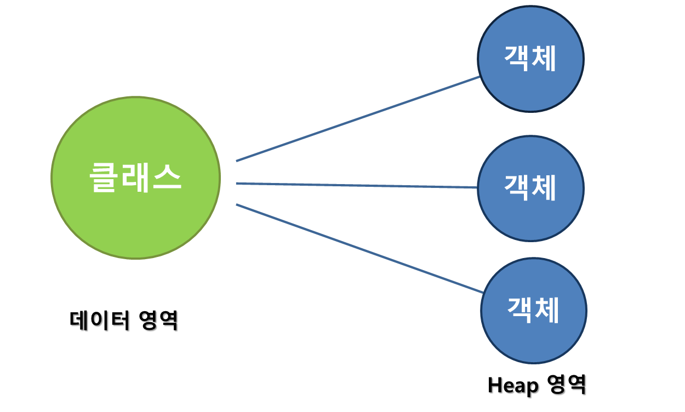

# static

**static은 객체를 생성하기 전에 클래스에 접근하여 값을 공유할 수 있다.**
**클래스 변수라고 할 수 있다.**



**Static은 데이터영역에 직접 접근한다.**

### **static의 장점**

1. Heap영역을 사용할 필요가 없다(메모리 부족 현상 줄어듦).
2. 클래스 값을 공유해야하는 상황에서 유용하다.

### **static의 단점**

1. static변수가 과도하게 많으면 시스템운영속도가 느려질 수 있다.

<br>

**static 변수를 사용하여 자판기만들기**

```java
public class Money {
	public static int money = 2000;
}
```

```java
public class Food {
	final static int water = 500;
	final static int drink = 1000;
	final static int Snack = 1500;

	public void Water() {
		Money.money = Money.money - water;
	}

	public void Snack() {
		Money.money = Money.money - Snack;
	}

	public void Drink() {
		Money.money = Money.money - drink;

	}

}
```

```java
import java.util.Scanner;

public class StaticTest {

	public static void main(String[] args) {
		Scanner sc = new Scanner(System.in);
		int input, water = 0, drink = 0, snack = 0;
		while (true) {
			if (Money.money == 0)
				break;

			System.out.println("현재 돈:" + Money.money + "\n1번 물(500원) \n2번 음료슈(1000원) \n3번 과자(1500원)");
			System.out.printf("입력: ");
			input = sc.nextInt();
			System.out.println();

			switch (input) {
			case 1: {
				if (Money.money - Food.water < 0) {
					System.out.println("돈이 부족합니다");
					continue;
				}
				Food inputWater = new Food();
				inputWater.Water();
				water++;
				break;
			}
			case 2: {
				if (Money.money - Food.drink < 0) {
					System.out.println("돈이 부족합니다");
					continue;
				}
				Food inputDrink = new Food();
				inputDrink.Drink();
				drink++;
				break;
			}
			case 3: {
				if (Money.money - Food.Snack < 0) {
					System.out.println("돈이 부족합니다");
					continue;
				}
				Food inputSnack = new Food();
				inputSnack.Snack();
				snack++;
				break;
			}
			}

		}

		System.out.println("돈을 다 썻습니다.");
		System.out.println("물 " + water + "개, " + "음료 " + drink + "개, " + "과자 " + snack + "개 ");
	}

}
```

# 상속

### 상속이 필요한 이유

1. 기존 결과물을 이용하기 때문에 빠르게 결과물을 만들 수 있다.
2. 다양한 객체를 상속을 통해서 하나의 객체로 묶을 수 있다.

### 상속 이용하기

**상속을 이용하여 FoodMachine클래스의 정보를 FoodMarket클래스에 가져오기**

```java
public class FoodMachine {
	int water = 500;
	int drink = 1000;
	int snack = 1500;
}

public class FoodMarket extends FoodMachine {

	public static void main(String[] args) {
		System.out.println("물가격: " + water);
		System.out.println("음료수가격: " + drink);
		System.out.println("과자가격: " + snack);
	}
}

실행결과
-----------
물가격: 500
음료수가격: 1000
과자가격: 1500


```

<br>

### 오버라이드란?

**부모클래스에 있는 메소드를 자식클래스에서 재정의하여 사용하는 것**
<br>

### 오버라이드 이용하기

**물건을 10개단위로 파는 대형식품점을 위해 상속받은 정보를 재정의하기.**

```java
public class Money {
	public static int money = 10000;
}

public class FoodMachine {
	static int water = 500;

	public void Water() {
		Money.money = Money.money - water;
	}
}


```

```java
public class BigMarket extends FoodMachine{

	public void Water() {
		Money.money = Money.money - water*10;
	}

	public static void main(String[] args) {

    BigMarket bigmarket = new BigMarket();
    bigmarket.Water();
    System.out.println("남은 돈: " + Money.money);

	}

실행결과
------------------
남은 돈: 5000

```

### super, this란?

**super은 상위 클래스(상속받은 클래스)에서 먼저 값을 찾는다.**

**this는 해당 클래스에서 값을 찾는다. super의 반대 개념이다.**

<br>

### super, this이용하기

**할인매장에서 물가격을 다시 정하기**

```java
public class FoodMachine {
	 static int water = 500;

}
```

```java
import java.util.Scanner;

public class SaleMarket extends FoodMachine {

	public void Water(int water) {
		System.out.println("기존 물가격: " + super.water + "원");
		this.water = water;
		System.out.println("변경된 물가격: " + this.water + "원");
	}

	public static void main(String[] args) {
		Scanner sc = new Scanner(System.in);
		SaleMarket salemarket = new SaleMarket();

		System.out.print("물 가격: ");
		int Price = sc.nextInt();
		salemarket.Water(Price);

	}

}


실행결과
----------------
변경할 물 가격입력: 400

기존 물가격: 500원
변경된 물가격: 400원


```
